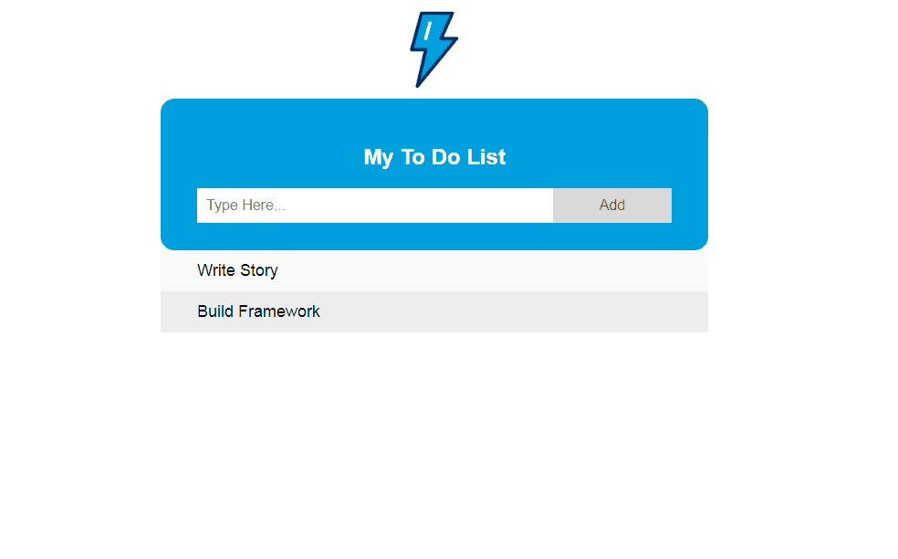

#   ToDo App

Here will be some information about the app.

## How to start?

Start simple by running `yarn watch` (or `npm run watch`, if you set up the project with `npm`). This will start the project with a local development server.

